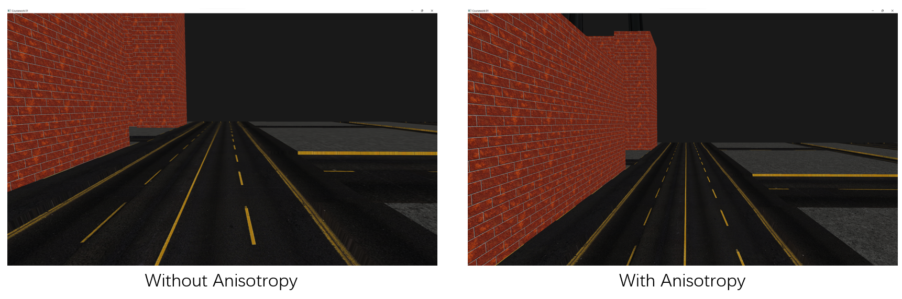

### Brief Intro 

This is a coursework project for HPG program in University of Leeds.

It is based on the Vulkan framework provided by Dr. Markus Billeter.

Models used in this project is from ["TDA 362/DIT223 Tutorials"](http://www.cse.chalmers.se/edu/course/TDA362/tutorials/index.html).

### Features of the Project 

1. Camera control
2. Mipmap + Anisotropy

